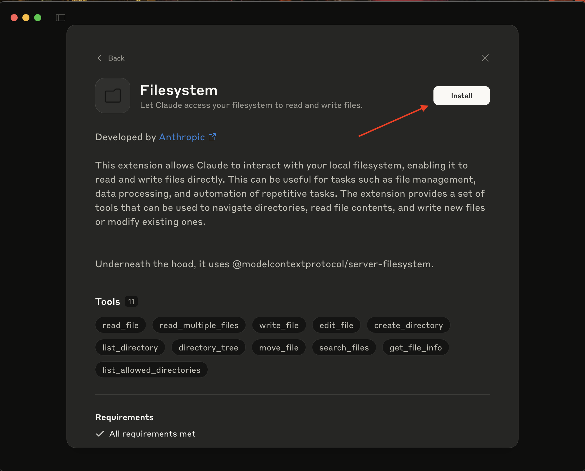
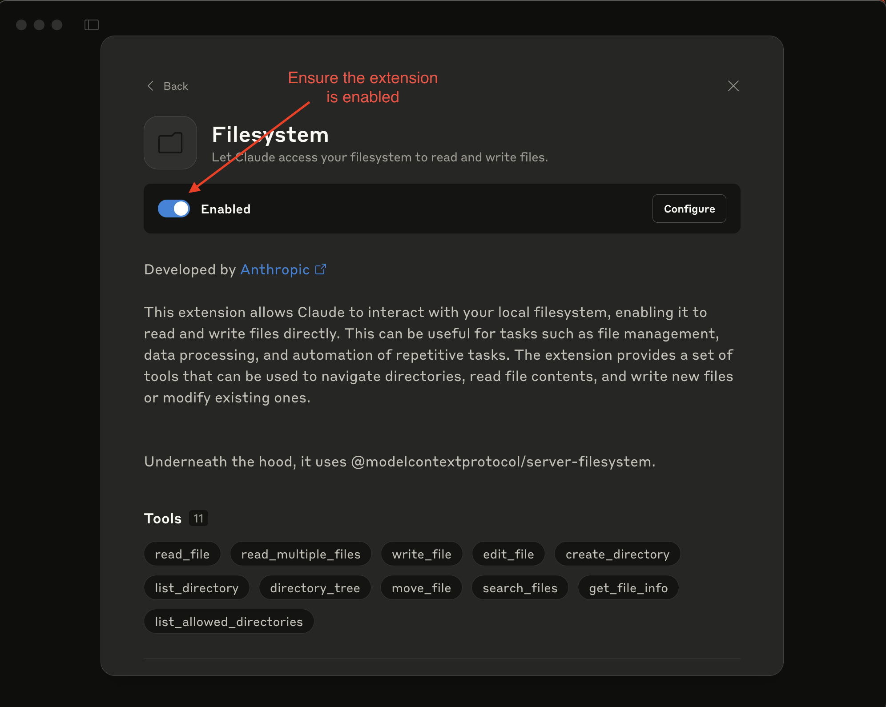
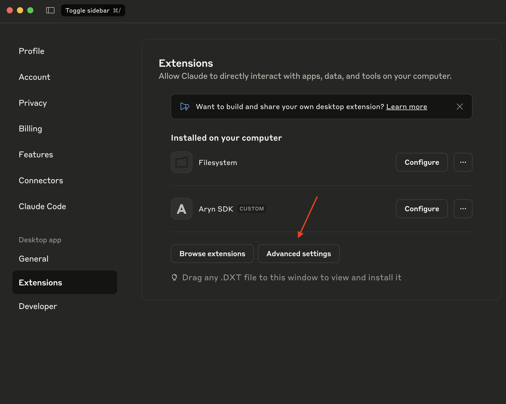
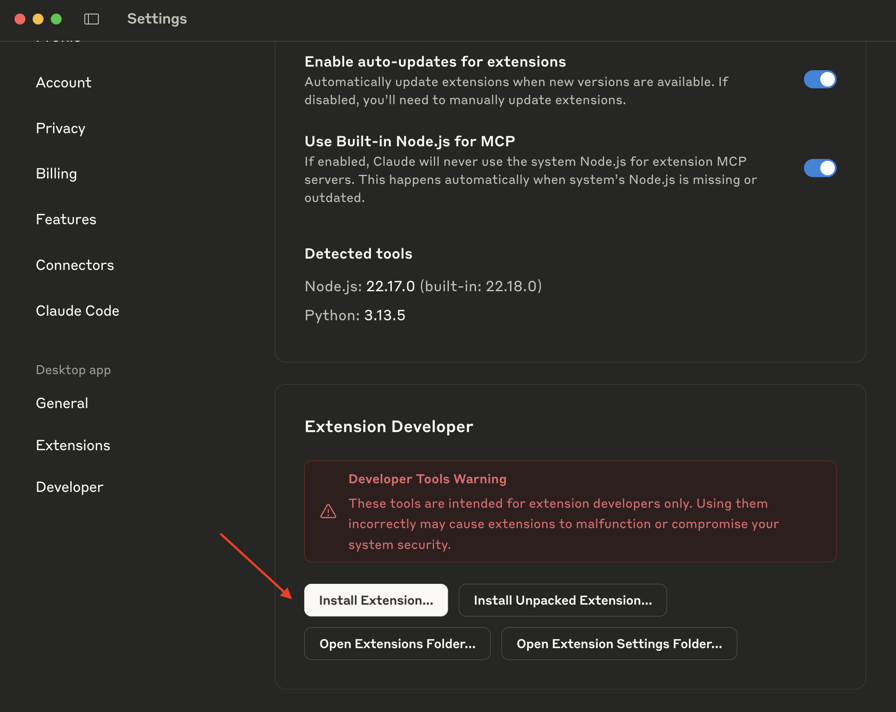

# Aryn Local MCP Server

## Installation

### Prerequisites
* Python 3.12 or higher. Install it [here](https://www.python.org/downloads/)
* [uv](https://github.com/astral-sh/uv) - Fast Python package installer and resolver
* An Aryn API key. You can create an account and receive a key for free [here](https://app.aryn.ai/)
* This MCP server works best in combination with a file system MCP server (see installation instructions below)
* An MCP server client like Claude Desktop (Recommended) or Claude Code

### Filesystem MCP
The Aryn MCP server requires absolute file paths to pdfs you want processed as inputs, so it works best when paired with an MCP server that can automatically manage files on your computer. Here is how to install one for Claude Desktop:





More documentation for the filesystem MCP server can be found [here](https://github.com/modelcontextprotocol/servers/tree/main/src/filesystem).

### One-Click Install for Claude Desktop (Claude Desktop only)

Instead of manually installing this MCP server, Claude Desktop allows for an easy one-click extension:

**Download the extension**: Retrieve the provided `.dxt` file from this repository, or download it [here](https://github.com/aryn-ai/mcp-server/releases/latest/download/mcp-server-extension.dxt).


Open the Claude Desktop settings




**Find the folder where the .dxt extension was downloaded and double click to install. Follow the installation steps when prompted**


**Now you're ready to go!**

For more details, refer to the [Claude Desktop Extensions documentation](https://www.anthropic.com/engineering/desktop-extensions).

### Manual Installation
If you're manually installing this MCP server, you need to install `uv` first, which provides the `uvx` command. Install it [here](https://docs.astral.sh/uv/getting-started/installation/).

After installation, you'll have access to both `uv` and `uvx` commands. The `uvx` command is what you'll use to run this MCP server.

Next, add the following configuration to your MCP client config file

```json
{
  "mcpServers": {
    "Aryn Local MCP Server": {
      "command": "uvx",
      "args": [
        "aryn-mcp-server"
      ],
      "env": {
        "ARYN_API_KEY": "YOUR_ARYN_API_KEY",
        "ARYN_MCP_OUTPUT_DIR": "<full path to directory where files will get saved (ie Users/username/Downloads)>"
      }
    }
  }
}
```

For client specific config implementation, see below:
* [Claude](https://docs.anthropic.com/en/docs/claude-code/mcp#use-mcp-prompts-as-slash-commands)
* [Cursor](https://docs.cursor.com/en/context/mcp)

### Troubleshooting

If you encounter `spawn uvx ENOENT` errors:

1. **Verify uv installation**: Run `which uvx` in your terminal to find the correct path

2. **Use the full path to uv**: Replace `"command": "uvx"` with `"command": "<full path to uvx>"`
